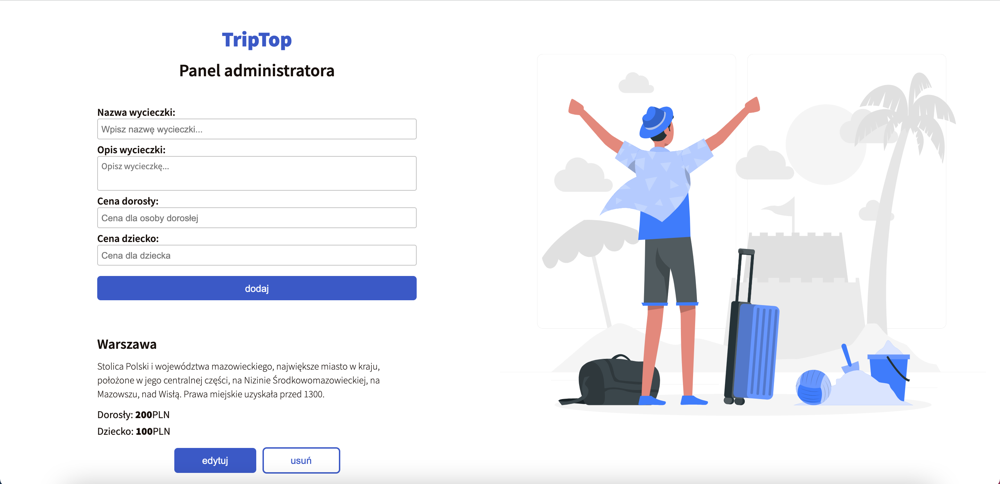
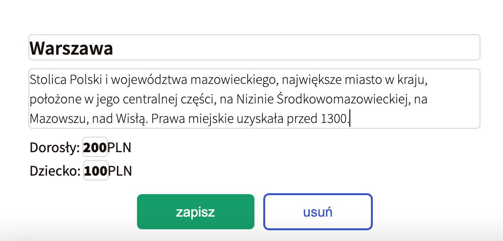
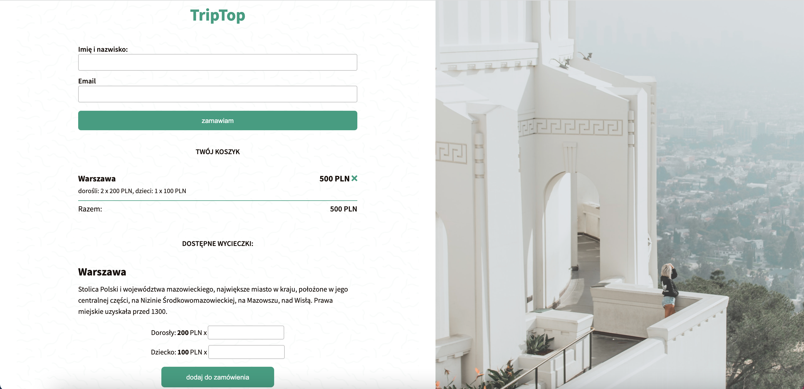
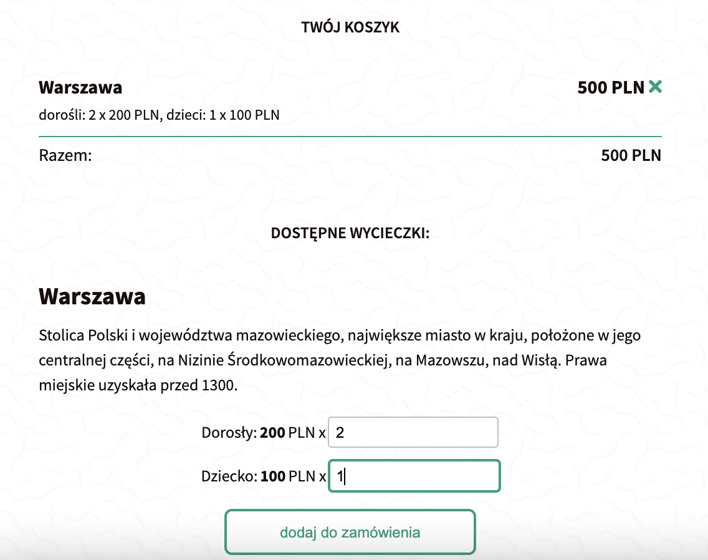

# Excursions platform

## :technologist: Technologies and metodologies

Technologies and metodologies used in this project:

**HTML / CSS / BEM / RWD / JavaScript /
API i Fetch / Webpack**

In this task, my job was to create platform, where you are able to create an excursion offer as an **admin** and choose excursion as a **client**.

## :mechanic: Admin

The admin panel includes options such as:

- adding excursions (containing its name, description and price per adult/child) to the website and also to the JSON file;
  
- removing newly created excursions;
- updating excursions data;
  

## :man_in_tuxedo: Client

The admin panel includes options such as:

- getting excursions from JSON file;
  
- adding chosen excursion to the basket and counting final price;
  
- making an order by submitting the top form and posting data on the JSON file.

## :mailbox: Feel free to contact me

You can find me on **[LINKEDIN](https://www.linkedin.com/in/rafa%C5%82-kazik-924b8710a/)**

## Thanks :handshake:

Thanks to my [Mentor - devmentor.pl](https://www.devmentor.pl) - for providing me with this task and for code review.
